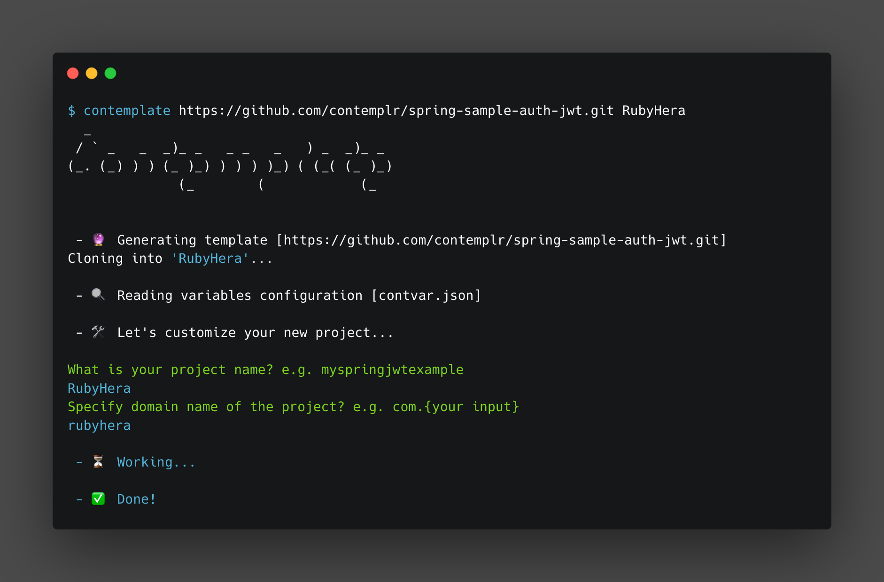

# @contemplr/contemplate



This tool helps you improve your templating flow, allowing you to specify more in-depth customization
capability for users. Customizable variables or parameters within a project can be specified by the template
owner, and a user will be prompted to specify values for these variables/parameters.

`@contemplr/contemplate` is meant to add more flexibility to creating and managing your project templates.
<br/>

## Usage

#### Step 1 : Creating your template project

To use this library, you will need to create a file named `contvar.json` in your project root.

Example from [spring-sample-auth-jwt](https://github.com/contemplr/spring-sample-auth-jwt):

```
spring-sample-auth-jwt
├── .mvn/wrapper
├── src/main
├── .gitignore
├── contvar.json
```

#### Configuration in `contvar.json`

The configuration file allows you to specify customizable variables/parameters within the project.

Example: [spring-sample-auth-jwt/contvar.json](https://github.com/contemplr/spring-sample-auth-jwt/blob/master/contvar.json)
```json
{
  "variables": [
    {
      "name": "contvarAppName",
      "prompt": "What is your project name? e.g. myspringjwtexample",
      "checks": [
        {
          "check": "^[A-z]+$",
          "error": "Project name must be only letters"
        }
      ]
    },
    {
      "name": "contvarDomainName",
      "prompt": "Specify domain name of the project? e.g. com.{your input}",
      "checks": [
        {
          "check": "^[A-z0-9]+$",
          "error": "Project name must be only letters or numbers"
        }
      ]
    },
    {
      "name": "contvarX-Access-Token",
      "prompt": "Specify access token response header name?",
      "value": "X-Access-Token",
      "checks": [
        {
          "check": "^[A-z-]+$",
          "error": "Project name must be only letters and hyphen"
        }
      ]
    },
    {
      "name": "contvarX-Refresh-Token",
      "prompt": "Specify refresh token response header name?",
      "value": "X-Refresh-Token",
      "checks": [
        {
          "check": "^[A-z-]+$",
          "error": "Project name must be only letters and hyphen"
        }
      ]
    }
  ]
}
```

##### Configuration keys

* `variables` represents a list of all customizable variables and parameter in the template.
Each variable can either be a content in a file or a file name that can be customized.

    Example (file
    content): [spring-sample-auth-jwt/pom.xml](https://github.com/contemplr/spring-sample-auth-jwt/blob/master/pom.xml)
    
    ```xml
    <project>
        <groupId>com.contvarDomainName</groupId>
        <artifactId>contvarAppName</artifactId>
        <version>0.0.1-SNAPSHOT</version>
        <name>contvarAppName</name>
        <description>contvarAppName</description>
    </project>
    ```
    
    Example (file
    name): [spring-sample-auth-jwt/src/.../AuthController.java](https://github.com/contemplr/spring-sample-auth-jwt/blob/master/src/main/java/com/auth/example/controllers/AuthController.java)
    
    ```java
    public void reauthorize(@RequestHeader("contvarX-Refresh-Token") String refreshToken) {
        ...
    }                            
    ```
    
    Example (file
    name): [spring-sample-auth-jwt/src/.../example](https://github.com/contemplr/spring-sample-auth-jwt/tree/master/src/main/java/com/auth/example)
    
    ```
    spring-sample-auth-jwt
    ├── controllers
    ├── entities
    ├── ...
    ├── contvarAppNameApplication.java
    ```
    
    N.B: <em>Variable names must start with the keyword `contvar`, the library uses this to identify what
    can be customized.</em>
    <br/><br/>

* `prompt` (optional) property represents some explanation of the variable to be customized. You can use this as a prompt
question
to the user. If this is not provided, a default prompt will be used
``Enter the value for "variable name":``.
<br/><br/>

* `checks` (optional) represents a list of constraints a template owner can specify against the inputs of user.
Each child of this property takes in:

  - `check` property a Regex that'll be used to test inputs
  - `error` property an error message to show a user when an input fails a check
  <br/><br/>

* `excludeFoldersRegex` (optional) property is used to specify the files or folders you would like to be excluded entirely
from customization. Example:
``"excludeFoldersRegex": [/.mvn/, /node_modules/]``
<br/><br/>

#### Step 2 : Installing the tool
The library is a NPM package can be installed using any of the commands below:
##### Installing locally
```bash
npm install @contemplr/contemplate
```

##### Installing globally
```bash
npm install -g @contemplr/contemplate
```
or in the latest NPM version
```bash
npm install @contemplr/contemplate --location=global
```
<br/>

#### Step 3 : Using the tool
Additional: `@contemplr/contemplate` requires that you have `git` CLI installed on your system. It depends on
git to clone your project.

```bash
contemplate repository_url [destination_folder]
```

- `repository_url` represents the template project url. This can be a repository hosted on any VCS platform
- `destination_folder` (optional) the destination folder that this project should be created/cloned into

##### Example
```bash
contemplate https://github.com/contemplr/spring-sample-auth-jwt.git NewApp
```
<br/>

### For Help

```bash
contemplate [-h]
```